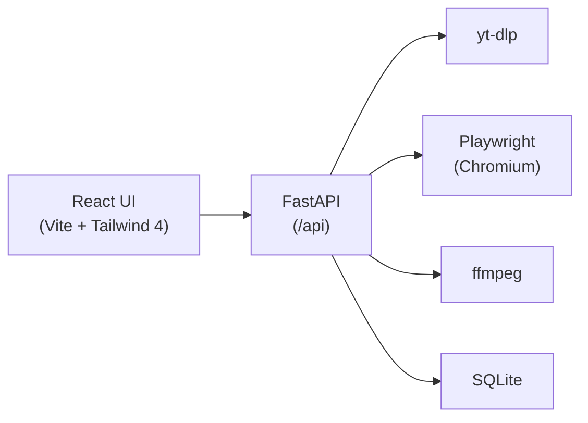

# Video Downloader

[](https://github.com/marteyhaw/video-downloader/actions/workflows/ci.yml)
[](LICENSE)
[](pyproject.toml)
[](https://github.com/astral-sh/ruff)
[](https://github.com/marteyhaw/video-downloader/actions/workflows/codeql.yml)
[](https://securityscorecards.dev/viewer/?uri=github.com/marteyhaw/video-downloader)

Local-first app to scan web pages for video streams and download them safely. Uses **yt-dlp** for major platforms and **Playwright** for generic pages. The React UI talks to a FastAPI backend on localhost only.

> **⚠️ Responsible use.** This tool is for downloading video **you have the right to access and save** — your own uploads, public-domain or openly-licensed media, or content you have explicit permission to download. Downloading copyrighted material without authorization, or in violation of a site's Terms of Service, may be unlawful in your jurisdiction. **You alone are responsible for how you use it.** DRM-protected streams are not supported and must not be circumvented.



## Prerequisites

- [uv](https://docs.astral.sh/uv/) (Python package manager)
- [Node.js](https://nodejs.org/) 20+
- [pnpm](https://pnpm.io/) 10+ (JS package manager — `npm install -g pnpm`, or `corepack enable`)
- [ffmpeg](https://ffmpeg.org/) on your `PATH`
- Chromium for Playwright (installed below)

## Setup

```powershell
cd video-downloader
copy .env.example .env
uv sync
uv run playwright install chromium
pre-commit install          # optional: enable ruff + oxlint/oxfmt hooks
cd frontend
pnpm install
```

**Cross-platform (bash):**

```bash
cp .env.example .env
uv sync
uv run playwright install chromium
pre-commit install
cd frontend && pnpm install
```

Edit `.env` if you need different ports (e.g. when another app uses 5173).

## Run (development)

From the project root:

```powershell
.\scripts\dev.ps1
```

Or run separately (use values from your `.env`):

```powershell
# Terminal 1 — API
uv run uvicorn backend.main:app --host 127.0.0.1 --port 8000 --reload

# Terminal 2 — UI (from frontend/)
pnpm run dev
```

Open the URL Vite prints (default **[http://localhost:5175](http://localhost:5175)**). The UI proxies `/api` to the backend at `VD_HOST`:`VD_PORT`.

FastAPI auto-generates interactive API docs at [http://localhost:8000/docs](http://localhost:8000/docs).

## Usage

1. Paste a page URL and click **Scan**.
2. Select a detected stream (yt-dlp or Playwright badge).
3. Choose container format and audio options, then **Download**.
4. Open the **History** tab — rename files, show in folder, or delete entries.

Downloads are saved under `downloads/` by default.

## Testing

```powershell
# Backend
uv run pytest tests/ -q

# Backend with coverage
uv run pytest tests/ --cov=backend --cov-report=term-missing

# Frontend
cd frontend && pnpm test
```

## Linting

```powershell
# Backend
uv run ruff check backend/ tests/

# Frontend
cd frontend && pnpm run lint && pnpm run typecheck && pnpm run format:check
```

## CI

GitHub Actions runs on every push/PR to `main`:
- Backend: ruff lint + format check + pytest
- Frontend: typecheck + oxlint + oxfmt (format check) + vitest

## Themes

The UI uses **Tailwind CSS v4** with a theme switcher in the upper-right corner:

- **Mode:** Light, Dark, or System (follows OS preference)
- **Palette:** Neutral (default), Ocean and Frost (cool), Sunset and Ember (warm)

Choices are saved in `localStorage` (`vd-theme-mode`, `vd-theme-palette`).

## Security

- Only `http`/`https` URLs; no `file://` or embedded credentials.
- Optional blocking of hosts that resolve to private/reserved IPs (SSRF mitigation).
- All files are written inside the configured downloads directory.
- Post-download magic-byte checks reject executables and non-media types.
- Size limits (default 5 GB per file).
- `ffmpeg` has a configurable timeout to prevent hung processes.
- `explorer` invocation uses list-form `subprocess.run` (no shell injection).
- API binds to `127.0.0.1`; CORS allows localhost frontend only.

See [docs/SECURITY.md](docs/SECURITY.md) for the full threat model.

## Limitations

- **DRM** (Widevine, etc.) cannot be downloaded.
- Sites that require login may need cookies (not supported in v1).
- Lazy-loaded media may require scrolling; Playwright waits briefly after load.
- Use only for content you have the right to download.

## Configuration

Copy [`.env.example`](.env.example) to `.env` at the project root. All settings use the `VD_` prefix.

| Variable | Default | Description |
| --- | --- | --- |
| `VD_HOST` | `127.0.0.1` | API bind address |
| `VD_PORT` | `8000` | API port |
| `VD_DEV_PORT` | `5175` | Vite dev server port |
| `VD_STRICT_DEV_PORT` | `true` | Vite exits when port is taken |
| `VD_CORS_ORIGINS` | *(auto)* | Comma-separated origins |
| `VD_DOWNLOADS_DIR` | `./downloads` | Output directory |
| `VD_DATABASE_URL` | `sqlite+aiosqlite:///…/video_downloader.db` | SQLite database |
| `VD_MAX_FILE_BYTES` | `5368709120` | Max file size (5 GB) |
| `VD_BLOCK_PRIVATE_IPS` | `true` | Block SSRF to private networks |
| `VD_SCAN_TIMEOUT_SECONDS` | `30` | Playwright page load timeout |
| `VD_SCAN_YTDLP_RETRIES` | `2` | yt-dlp retries during scan |
| `VD_M3U8_FETCH_TIMEOUT_SECONDS` | `15` | Timeout for fetching HLS manifests during scan |
| `VD_YTDLP_CONCURRENT_FRAGMENTS` | `8` | Parallel fragment downloads |
| `VD_YTDLP_IMPERSONATE_ENABLED` | `true` | curl-cffi impersonation |
| `VD_YTDLP_IMPERSONATE_TARGET` | `chrome` | Impersonation target browser |
| `VD_PLAYWRIGHT_AUTOPLAY_ENABLED` | `true` | Try autoplay triggers |
| `VD_PLAYWRIGHT_AUTOPLAY_WAIT_MS` | `3000` | Wait after autoplay |
| `VD_PLAYWRIGHT_CLICK_TIMEOUT_MS` | `1000` | Timeout per UI click |
| `VD_PLAYWRIGHT_AUTOPLAY_ONLY_IF_EMPTY` | `false` | Skip autoplay if streams found |
| `VD_SCAN_EMBEDS` | `true` | Discover embedded videos (any yt-dlp-supported site) |
| `VD_MAX_EMBEDS` | `10` | Max discovered embeds to scan |
| `VD_PLAYWRIGHT_GALLERY_STEPPING_ENABLED` | `false` | Step gallery/carousel widgets |
| `VD_PLAYWRIGHT_GALLERY_MAX_STEPS` | `32` | Global gallery click cap |
| `VD_PLAYWRIGHT_GALLERY_STEPS_PER_WIDGET` | `6` | Clicks per widget |
| `VD_PLAYWRIGHT_GALLERY_MAX_WIDGETS` | `15` | Max widgets to process |
| `VD_PLAYWRIGHT_GALLERY_STEP_WAIT_MS` | `1200` | Wait between gallery clicks |
| `VD_MAX_RETAINED_JOBS` | `200` | In-memory job history cap |
| `VD_DOWNLOAD_TIMEOUT_SECONDS` | `120` | HTTP client timeout |
| `VD_FFMPEG_TIMEOUT_SECONDS` | `600` | ffmpeg process timeout |
| `VD_YTDLP_DOWNLOAD_RETRIES` | `10` | yt-dlp download retries |
| `VD_YTDLP_DOWNLOAD_FRAGMENT_RETRIES` | `10` | yt-dlp fragment retries |

## Troubleshooting

| Problem | Fix |
| --- | --- |
| `ffmpeg not found` warning | Install ffmpeg and add to `PATH` |
| `HTTP 403` on Cloudflare sites | Run `uv sync` to install `curl_cffi` |
| Scans time out | Increase `VD_SCAN_TIMEOUT_SECONDS` |
| Port conflict | Change `VD_DEV_PORT` / `VD_PORT` in `.env` |
| Playwright browser missing | Run `uv run playwright install chromium` |

## Project Structure

```
backend/
├── api/              # FastAPI route handlers (scan, download, history)
├── db/               # SQLAlchemy models and session
├── models/           # Pydantic request/response schemas
├── services/         # Business logic
│   ├── security.py             # URL validation, path safety, file checks
│   ├── scanning/               # orchestrator, ytdlp_scanner, ytdlp_support, progress
│   ├── playwright/             # scanner, capture, autoplay, gallery, m3u8
│   ├── embeds/                 # registry, page_embeds, generic_embeds
│   ├── download/               # jobs, strategies, manager, ffmpeg, ytdlp_opts, file_resolution
│   └── media/                  # urls, codecs, constants
├── config.py                   # Settings with VD_ prefix
└── main.py                     # App entry point
frontend/
├── src/
│   ├── api/          # Typed API client
│   ├── components/   # React components
│   ├── hooks/        # useScan, useDownloadJob, useToasts, …
│   ├── theme/        # ThemeProvider + palettes
│   └── utils/        # Shared utilities and filters
tests/                # pytest backend tests
docs/                 # Architecture, API, security, deployment docs
.github/workflows/    # CI configuration
scripts/dev.ps1       # Dev launcher
```

See [docs/ARCHITECTURE.md](docs/ARCHITECTURE.md) for detailed design, [docs/API.md](docs/API.md) for endpoint reference, and [docs/DEVELOPMENT.md](docs/DEVELOPMENT.md) for contributor guide.
