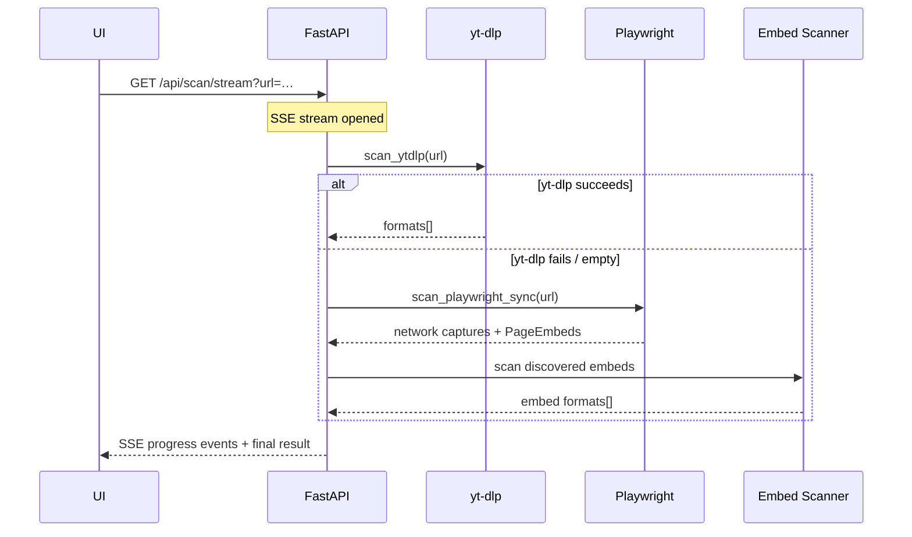

# Architecture

## Overview

Video Downloader is a two-tier local application: a **FastAPI backend** (Python) and a **React frontend** (TypeScript/Vite). All communication happens over HTTP on `localhost`.

## Backend Module Structure

```
backend/
├── main.py                     # FastAPI app entry, lifespan, health endpoint
├── config.py                   # Pydantic-settings with VD_ env prefix
├── api/
│   ├── __init__.py             # http_exception_from_security helper
│   ├── download.py             # POST /download, GET /jobs/{id}, filename-check
│   ├── history.py              # GET/PATCH/DELETE /history, reveal-in-folder
│   └── scan.py                 # POST /scan, GET /scan/stream (SSE)
├── db/
│   ├── models.py               # DownloadRecord SQLAlchemy model
│   └── session.py              # Engine, session factory, init_db
├── models/
│   └── schemas.py              # Pydantic request/response schemas
└── services/
    ├── security.py             # URL validation, path safety, file validation
    ├── scanning/
    │   ├── orchestrator.py     # Unified scan pipeline coordinator
    │   ├── ytdlp_scanner.py    # yt-dlp format extraction
    │   ├── ytdlp_support.py    # yt-dlp extractor-registry support check
    │   └── progress.py         # Progress callback type alias
    ├── playwright/
    │   ├── scanner.py          # Playwright scan orchestrator
    │   ├── capture.py          # Network response capture state
    │   ├── autoplay.py         # Playback triggers (lazy-loaded players)
    │   ├── gallery.py          # Widget/carousel stepping
    │   ├── gallery_selectors.py # Generic gallery/carousel/widget selectors
    │   └── m3u8.py             # HLS manifest fetching and parsing
    ├── embeds/
    │   ├── registry.py         # Embed provider registry
    │   ├── page_embeds.py      # PageEmbeds dataclass
    │   └── generic_embeds.py   # Generic embed discovery (yt-dlp-supported URLs)
    ├── download/
    │   ├── jobs.py             # In-memory job registry + lifecycle
    │   ├── strategies.py       # yt-dlp / HLS / direct download implementations
    │   ├── manager.py          # Run orchestration + history persistence
    │   ├── ffmpeg.py           # ffmpeg HLS download wrapper
    │   ├── ytdlp_opts.py       # Shared yt-dlp option building
    │   └── file_resolution.py  # File-by-stem lookup for yt-dlp output
    └── media/
        ├── urls.py             # URL classification: HLS, segments, video capture
        ├── codecs.py           # HLS codec parsing (H.264, VP9, etc.)
        └── constants.py        # Shared VIDEO_SUFFIXES
```

## Scan Pipeline



1. **yt-dlp native scan** — tries all yt-dlp extractors first (YouTube, Twitter, Vimeo, etc.). If the URL matches a native extractor, this is authoritative.
2. **Playwright network capture** — falls back to launching headless Chromium, intercepting all network responses, and collecting video URLs (HLS manifests, direct MP4s). Also triggers autoplay for lazy-loaded players.
3. **Embed discovery** — while Playwright has the page open, discovers embedded video URLs (any yt-dlp-supported site) and runs yt-dlp on each.
4. **Gallery stepping** — optionally clicks through gallery/carousel widgets to discover more embed URLs.

## Download Strategies

| Strategy | When used | Implementation |
| --- | --- | --- |
| yt-dlp with format_id | Source is `ytdlp` and format_id is set | `yt_dlp.YoutubeDL.download()` |
| yt-dlp HLS | Source is `playwright` and URL is `.m3u8` | yt-dlp with `--http-headers Referer:…` |
| ffmpeg HLS | Generic HLS without yt-dlp format | `ffmpeg -i manifest.m3u8 -c copy output.mp4` |
| Direct HTTP | Non-HLS direct URL | Streamed via `httpx` with size limit |

## Technology Choices

| Layer | Technology | Why |
| --- | --- | --- |
| Backend framework | FastAPI | Async support, auto-docs, Pydantic validation |
| ORM | SQLAlchemy 2.0 + aiosqlite | Async SQLite for zero-config local DB |
| Video extraction | yt-dlp | Best-in-class extractor library |
| Browser automation | Playwright | Reliable headless Chromium for network capture |
| HTTP streaming | ffmpeg | Industry-standard HLS/DASH muxing |
| Frontend framework | React 18 | Component model, hooks, ecosystem |
| Styling | Tailwind CSS 4 | Utility-first with CSS variables for theming |
| State management | TanStack Query | Server state caching, polling, invalidation |
| Build tool | Vite 6 | Fast HMR, TypeScript support |
| Python tooling | Ruff | Fast linting and formatting |
| JS tooling | oxlint | High-performance TypeScript/React linting |
| Package management | uv (Python), pnpm (JS) | Fast, deterministic installs; exact-pinned + 7-day min release age |

## Security Model

- **URL validation** — rejects non-HTTP schemes, embedded credentials, and optionally private IPs (SSRF protection)
- **Schema validation** — pydantic validators on all URL fields (format, host, no credentials)
- **Path traversal** — all download paths are resolved and verified to be within `downloads_dir`
- **File validation** — post-download MIME type checking via `filetype`, blocked extension list
- **Size limits** — configurable max file size, enforced during streaming
- **Subprocess safety** — all subprocess calls use list-form arguments, ffmpeg has a timeout
- **CORS** — restricted to configured localhost origins

## Frontend Architecture

The frontend uses a hook-based architecture:

- **`useScan`** — manages scan state, SSE connection, progress events, selected item, and filters
- **`useDownloadJob`** — manages download mutation, job polling, toast notifications
- **`useToasts`** — toast stack with auto-dismiss and max limit
- **`App.tsx`** — layout shell composing hooks and rendering tab panels

Components are memoized where beneficial (`MediaCard` via `React.memo`). The `QueryClient` is configured with sensible defaults (no refetch on window focus).

## Adding New Features

### Embed discovery

Embed discovery is **generic** — `generic_embeds.py` collects candidate URLs (iframes, links, data-attributes) and keeps only those yt-dlp has a dedicated extractor for (`is_ytdlp_supported_url`). There is **no per-site embed code**; new sites are supported automatically as yt-dlp adds extractors.

- To broaden *what counts as a candidate* (e.g. a new URL-bearing attribute), extend the selectors/regex in `generic_embeds.py`.
- The `embed_registry` abstraction remains for the rare case you need a fundamentally different discovery strategy, gated by its own `scan_*`/`max_*` settings.

### New Download Backend

1. Add an async strategy function in `download/strategies.py`
2. Add a conditional branch in `download/manager.py::_run_download`
3. Add tests mocking the external tool
